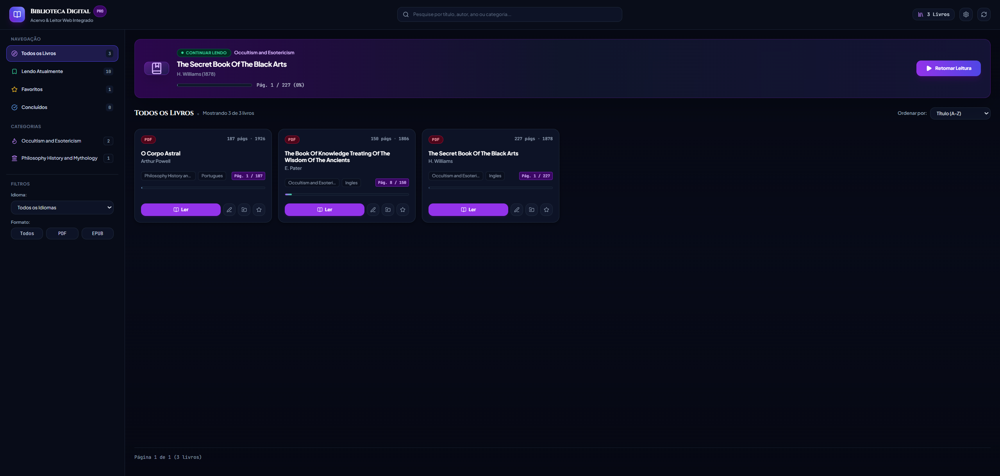
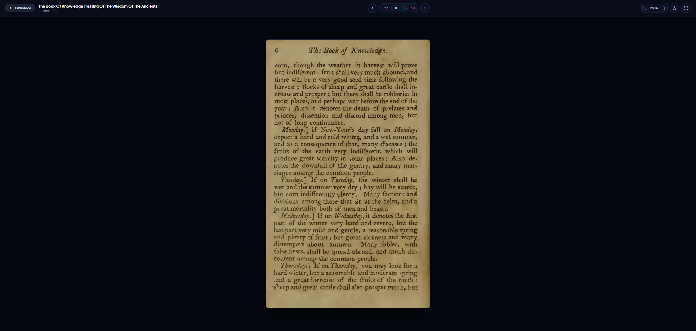
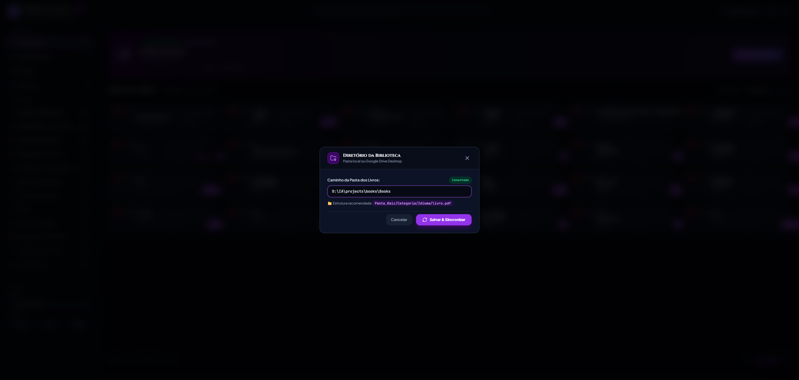

# Biblioteca Digital & Leitor Web



Sistema web local desenvolvido para organização, catalogação e leitura contínua de grandes acervos de livros digitais nos formatos **PDF** e **EPUB**.

---

## Por que este projeto foi criado?

Após reunir um acervo com mais de **10.000 livros e documentos em PDF e EPUB**, gerenciar e ler esse material usando leitores de PDF tradicionais ou o explorador de arquivos padrão se tornou pouco prático.

Alguns desafios frequentes motivaram a criação deste sistema:

1. **Perda de progresso de leitura**: Ao estudar dezenas de livros diferentes, era difícil lembrar em qual página cada leitura havia sido interrompida.
2. **Cansaço visual em leituras longas**: A grande maioria dos PDFs antigos ou escaneados possui páginas em branco com texto preto, o que cansa a vista à noite.
3. **Conflito com gerenciadores de download (IDM)**: Ao abrir links locais de PDFs no navegador, extensões como o Internet Download Manager costumam interceptar o arquivo tentando baixá-lo em vez de permitir a leitura imediata.
4. **Organização física dos arquivos**: A necessidade de renomear livros, padronizar metadados (Título, Autor, Ano) e mover arquivos entre pastas de categorias e idiomas sem precisar manipular manualmente caminhos no explorador de arquivos.
5. **Integração com nuvem**: Permitir que os livros fiquem tanto em uma pasta local do computador quanto sincronizados em uma unidade do Google Drive Desktop, sem quebrar o leitor ou banco de dados.

Com isso em mente, desenvolvi este ambiente focado exclusivamente em **estudo, pesquisa e leitura sem distrações**.

---

## Funcionalidades Principais

### Leitor Web Integrado (PDF e EPUB)
- **Modo Noturno e Zoom Ajustável**: O leitor permite zoom flexível (até 300%) para documentos escaneados antigos e conta com inversão de cores para reduzir o cansaço visual.
- **Navegação fluida**: Controle de páginas pelo teclado (`←` e `→`), salto direto para qualquer página e visualização em tela cheia (`F`).
- **Carregamento direto em memória**: Os livros são transmitidos via payload seguro em Base64 e decodificados na memória do navegador, impedindo que o IDM intercepte a leitura.



### Retomada Automática de Leitura
- O sistema salva automaticamente a página atual e a porcentagem de leitura de cada livro no banco de dados SQLite local.
- O card de destaque **Continuar Lendo** na página inicial exibe o último livro aberto, com barra de progresso e botão de retomada rápida com 1 clique.

### Descoberta Dinâmica de Categorias e Idiomas
- O sistema não utiliza categorias fixas no código. Ele lê automaticamente qualquer estrutura de pastas existente no diretório configurado:
  ```text
  Acervo_Livros/
  ├── Filosofia/
  │   ├── Portugues/
  │   └── Ingles/
  ├── Historia/
  │   └── Portugues/
  └── Ficcao/
      └── Portugues/
  ```
- O menu lateral adapta-se sozinho às pastas encontradas e aplica ícones contextuais com base nos nomes das categorias.

### Configuração Flexível de Diretório
- É possível apontar a biblioteca para qualquer pasta local (`C:\Livros`, `D:\Acervo`) ou unidade do Google Drive (`G:\Meu Drive\Books`).
- O caminho pode ser alterado a qualquer momento pelo botão de configurações na interface web, com validação de pasta e sincronização automática.



### Edição de Metadados e Movimentação no Disco
- **Renomeação**: É possível ajustar Título, Autor e Ano direto no card. O sistema renomeia o arquivo físico no disco no padrão `(ANO) Titulo - Autor.ext`.
- **Mover e Criar Categorias**: Permite transferir o arquivo físico para outra categoria ou idioma, criando as pastas necessárias automaticamente.

---

## Desenvolvimento

Este sistema foi idealizado e construído utilizando o **Google Antigravity**, um ambiente avançado de desenvolvimento orientado por IA, utilizando o modelo **Gemini 3.7 Flash High** em processo de *pair programming*.

A IA foi responsável por estruturar toda a arquitetura da aplicação:
- Criação da API REST e rotas assíncronas em **FastAPI**.
- Modelagem do banco de dados local em **SQLite** com indexação e migrações dinâmicas.
- Implementação do leitor web com **PDF.js** e **ePub.js**, incluindo o pipeline em memória contra o IDM.
- Construção da interface Single Page Application (SPA) em **Tailwind CSS** com tema escuro imersivo.
- Desenvolvimento do scanner inteligente com suporte a diretórios dinâmicos e extração automática de páginas.

---

## Estrutura do Projeto

```text
├── app/
│   ├── config.py          # Configurações de diretório da biblioteca (config.json)
│   ├── database.py        # Banco de dados SQLite, metadados e progresso de leitura
│   ├── scanner.py         # Sincronizador de pastas e extração de páginas
│   ├── main.py            # Backend FastAPI e rotas de streaming em memória
│   └── static/
│       ├── index.html     # Interface do usuário (SPA)
│       ├── css/style.css  # Estilos do tema escuro
│       ├── js/
│       │   ├── app.js         # Lógica da interface, paginação e filtros
│       │   ├── pdf-viewer.js  # Renderizador de PDF via canvas
│       │   └── epub-viewer.js # Renderizador de EPUB
│       └── vendor/        # Dependências locais (PDF.js, ePub.js, Lucide)
├── docs/images/           # Imagens da documentação
├── iniciar_biblioteca.bat # Script de inicialização rápida para Windows
├── run_server.py          # Script de execução padrão em Python
├── library.db             # Banco SQLite gerado automaticamente
├── LICENSE                # Licença MIT
└── README.md              # Documentação
```

---

## Como Executar

### Pré-requisitos
- Python 3.10 ou superior.

### 1. Clonar o repositório
```bash
git clone https://github.com/ArthurSNeto/books-library.git
cd biblioteca-digital
```

### 2. Instalar as dependências
```bash
pip install fastapi uvicorn pydantic requests pypdf
```

### 3. Iniciar o sistema

**No Windows:**
Basta dar um duplo clique no arquivo:
`iniciar_biblioteca.bat`

**No Linux / macOS / Terminal:**
```bash
python run_server.py
```

O sistema abrirá automaticamente no navegador em:
`http://127.0.0.1:8000`

---

## Atalhos do Teclado no Leitor

| Tecla | Ação |
| :--- | :--- |
| `→` ou `PageDown` | Próxima Página |
| `←` ou `PageUp` | Página Anterior |
| `+` | Aumentar Zoom |
| `-` | Diminuir Zoom |
| `F` | Alternar Tela Cheia |
| `Esc` | Fechar Leitor e Voltar ao Acervo |

---

## Licença

Este projeto está sob a licença [GNU Affero General Public License v3.0 (AGPL-3.0)](LICENSE).
